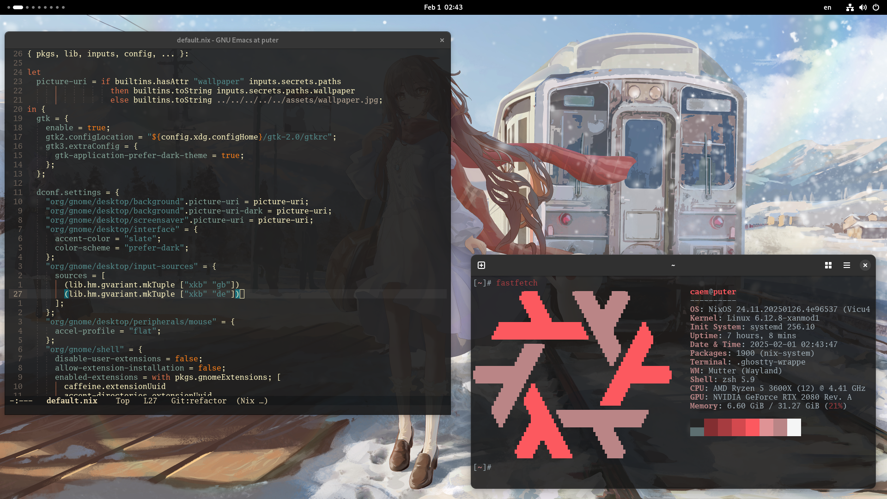

# nixos-system-config
My modular NixOS configuration.

## About
This is the NixOS configuration that I daily drive on my system. Feel free to use,
modify and share this configuration to your heart's content, no attribution required.

## Screenshots
[Wallpaper](https://yande.re/post/show/30591).



## Layout
```
├── assets                                  ; Binary assets tracked in git
│   ├── screenshot.png
│   └── wallpaper.jpg
├── dotfiles                                ; GNU stow compatible dotfiles directory
│   └── ...                                 ; Stores configurations that do not depend on Nix
├── flake.lock
├── flake.nix                               ; Entry point
├── home                                    ; home-manager configuration
│   ├── default.nix                         ; User and home-manager options
│   ├── packages                            ; Per-package home-manager configuration
│   │   └── ...
│   └── persist.nix                         ; Home opt-in state directories and files
├── hosts                                   ; Host configurations
│   └── workstation
│       ├── default.nix                     ; Host configuration.nix equivalent
│       ├── hardware-configuration.nix      ; Host hardware specific configuration
│       └── persist.nix                     ; System wide opt-in state directories and files
├── lib                                     ; Custom helper functions
│   ├── default.nix
│   └── ...
├── modules                                 ; System modules and sets of packages
│   ├── desktop
│   │   ├── apps
│   │   │   └── ...
│   │   └── environments
│   │       └── ...
│   └── system
│       └── ...
├── README.md
└── secrets                                 ; Location of secrets not tracked in the git tree
    └── pass
```

## Installing
This configuration uses impermanence with btrfs snapshots so you'll have to partition
your system in a certain way.

First you'll need this partition layout, assuming you're installing on `nvme0n1`.
```
DEVICE              FILESYSTEM      PURPOSE
/dev/nvme0n1
├─/dev/nvme0n1p1    vfat            EFI partition
└─/dev/nvme0n1p2    btrfs           Partition to house all the subvolumes
```

Inside of the btrfs root volume we're going to need 2 subvolumes.
```
SUBVOLUME           MOUNT           PURPOSE
root                /               Impermanent data
nix                 /nix            Permanent data
```

You'll also need to create a read-only snapshot of the `root` subvolume
and call it `root-blank`.

After you've mounted all the subvolumes and EFI partition (`/boot`) in `/mnt`
clone this repository in to `/mnt/nix/config`. Adjust all the block ids of the partitions
in `hardware-configuration.nix` and create a hashed password using `mkpasswd` and store it
in the `secrets` directory as `pass`.  

Finally, in the config directory run `nixos-install --flake '.#'`, reboot and you're done.

## Updating
This configuration sets up [nh](https://github.com/viperML/nh) for a prettier and more convenient
way of keeping the system up to date. To update you can simply run:
```sh
nix flake update /nix/config
nh os switch
```
